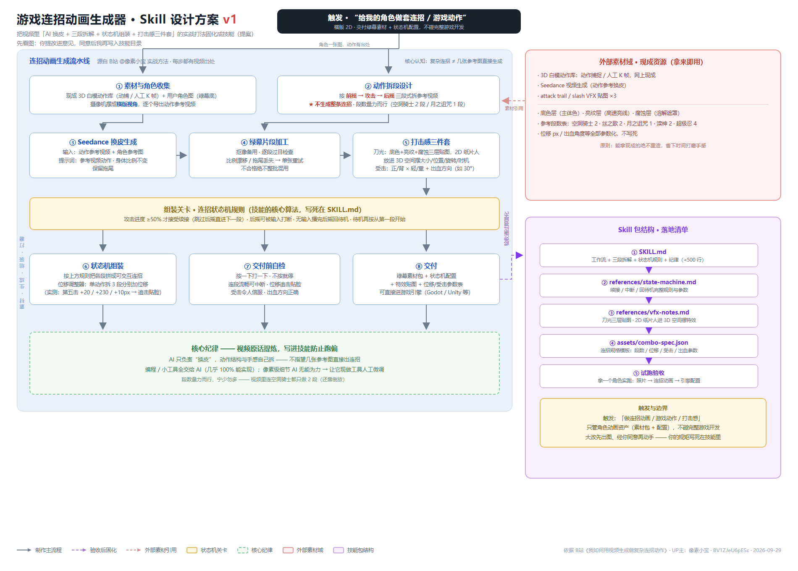

# 游戏连招动画生成器（combo-anim-maker）

> 一个 ZCode 技能：**给 AI 一张角色图，还你一套横版游戏里"能打"的连招动画。**



## 这个 skill 是干什么的？

一句话：**把"用 AI 视频生成做游戏动作"这套实战方法，固化成一条可复用的流水线。**

你要做横版动作游戏，需要一个角色的连招：按一下打一下、连按有连段、砍到敌人有受击反馈。你试着直接让 AI"生成一段连招动画"——得到的是一整串漂亮但**没法玩**的视频：不能停、不能断、不能接你的操作。

这个 skill 解决的就是这个问题。它把 B站 UP主 **像素小宝**《我如何用视频生成做复杂连招动作》（BV1ZJeU6pESc）里的完整打法，拆成了 8 步流水线 + 1 套状态机规则 + 1 份参数模板。

## 它凭什么能行？四个关键思路

| 思路 | 一句话解释 |
|------|-----------|
| **白模做骨架** | 不让 AI 凭空造动作——用现成的 3D 白模动作（动捕/手工 K 帧）做参考 |
| **AI 只换皮** | 把白模动作视频 + 你的角色图喂给 Seedance："参考视频动作，保持身体比例不变，保留拖尾" |
| **三段拆解** | 绝不一次生成整条连招！按「前摇→攻击→后摇」分段生成，才可能做成交互连招 |
| **状态机组装** | 游戏引擎里用状态机拼段：攻击进度 ≥50% 才能续接、后摇可被打断、不按就停 |

最后补上**打击感三件套**——刀光（三层贴图沿武器轨迹拉长）、追击位移（第五击拆 3 段加 +20/+230/+10px 贴脸追击）、受击反馈（正/背 × 轻/重 4 套动画 + 出血方向）——连招才算"能打"。

## 快速上手（3 步）

1. **触发**：在 ZCode 里说 ——
   - "给我的角色做一套连招动画"
   - "帮我做横版游戏的攻击动作，要带打击感"
   - "用 Seedance 给这个角色换皮做出招动画"
2. **配合**：给一张角色图（绿幕/纯色底最佳）→ AI 找白模动作、拆段、报生成张数与积分 → 你确认风格 → 批量生成
3. **收货**：拿到 `角色名-combo-pack.zip`（绿幕片段 + 特效贴图 + 受击动画 + combo-spec.json），导入 Godot / Unity 按 spec 接线即可

## 你会得到什么

```
我的角色-combo-pack.zip
├── clips/           绿幕角色动作片段（每段一条，已抠像）
├── vfx/             刀光三层贴图（底色层/亮纹层/腐蚀层）
├── hit-reactions/   敌人受击动画（正面/背面 × 轻/重）
├── combo-spec.json  连招规格：段数/续接窗口/位移/出血角度/贴图路径
└── README.txt       导入说明（Godot AnimationPlayer / Unity Animator 接线提示）
```

## 前提条件

- ZCode（本 skill 为 ZCode 技能，放在 `~/.zcode/skills/combo-anim-maker/` 自动被发现）
- 一个能用的 AI 视频生成服务（方法实测用的是字节的 **Seedance**，即梦内可调用），生成按张计积分
- 目标引擎：Godot / Unity（其他引擎照搬 spec 参数也行）
- Windows / macOS / Linux 均可——本 skill 只产出资产，不运行游戏

## 安装

三种方式任选：

1. **对话安装**：把本仓库的 zip 拖进 ZCode 对话说"帮我安装这个连招动画 skill"
2. **手动**：`git clone https://github.com/<你的用户名>/combo-anim-maker.git` 到 `~/.zcode/skills/combo-anim-maker/`
3. **直接看**：`SKILL.md` 是给 AI 的工作手册，`README.md`（本文件）是给人看的教程

## 方法来源与致谢

整套方法论来自 B站 UP主 **像素小宝** 的视频《我如何用视频生成做复杂连招动作》：
https://www.bilibili.com/video/BV1ZJeU6pESc

本 skill 是对该方法的工程化整理，所有实战数字（提示词、50% 续接窗口、+20/+230/+10px 位移、30° 出血角）均出自视频原内容。感谢像素小宝的开源分享。

## FAQ

**Q：为什么不能直接让 AI 生成连招？**
A：直接生成的是"一整串动画"，游戏需要的是可交互的动作系统。三段拆解 + 状态机才是"游戏感"的来源。

**Q：一定要用白模吗？**
A：强烈建议。白模动作（动捕或 K 帧）是动作可信度的出处；没有参考视频，AI 画不出连贯可信的动作序列。

**Q：段数越多越爽吗？**
A：不。视频原话"量力而行"：空洞骑士 2 段（还靠倒放）、月之诅咒 1 段。默认 2~3 段，5 段封顶。

**Q：敌人数值也要状态机吗？**
A：不用。敌人出招直接整串播放（`mode: "enemy"`），打击感靠受击反馈补。

**Q：生成的动作是原地的，怎么打到人？**
A：给关键动作分段加位移（如第五击 +230px 的跳砍），连招自动具备追击能力。
